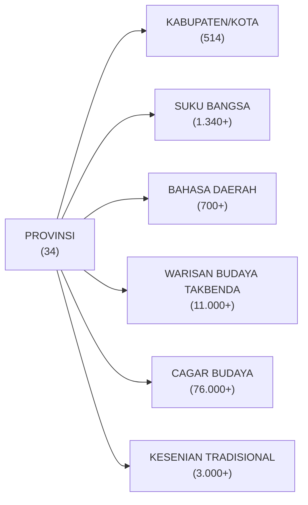
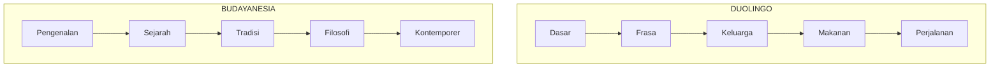
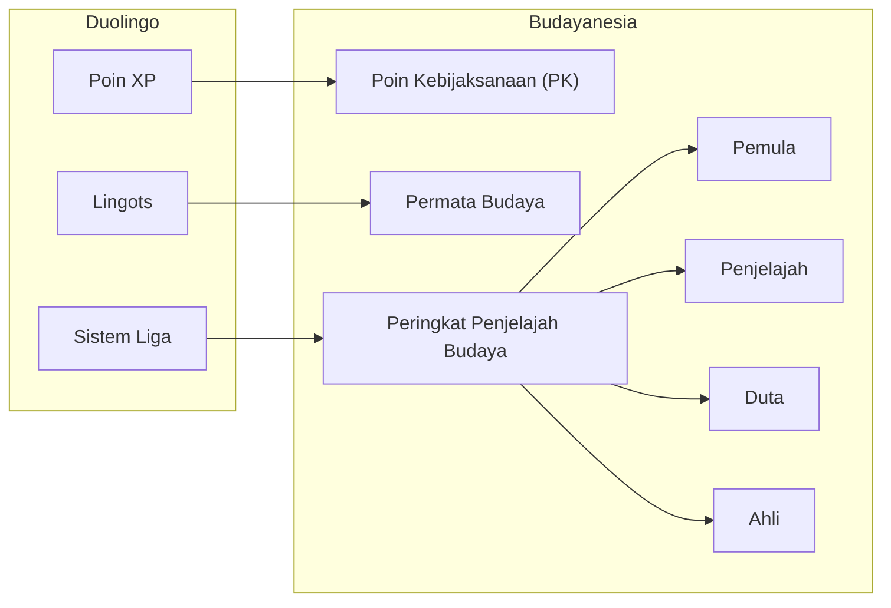
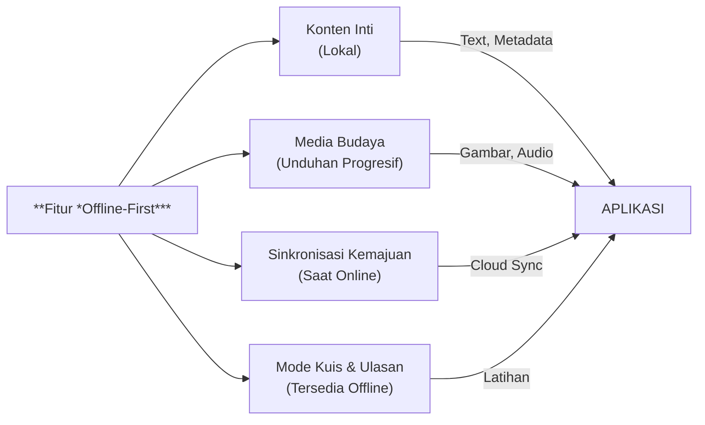

# BUDAYANESIA

"*Duolingo* untuk Khazanah Budaya Nusantara"

---

## 1. KONSEP INTI

**Budayanesia** adalah aplikasi pembelajaran budaya interaktif yang mengadopsi model sukses [*Duolingo*](https://www.duolingo.com/), tetapi fokus pada keragaman budaya Indonesia.

### 1.1. Analogi Inti

| Duolingo          | Budayanesia        |
|-------------------|--------------------|
| Bahasa Spanyol    | Budaya Jawa        |
| Bahasa Prancis    | Budaya Batak       |
| Bahasa Jerman     | Budaya Dayak       |
| Rangkaian Harian  | Perjalanan Budaya  |
| Pohon Bahasa      | Peta Budaya        |
| Poin XP           | Poin Kebijaksanaan |

### 1.2. Proposisi Nilai

"Seperti *Duolingo* membuat belajar bahasa menjadi menyenangkan dan mudah diakses, **Budayanesia** membuat mengenal budaya Indonesia menjadi menarik dan bermakna."

---

## 2. SUMBER DATA RESMI

### 2.1. Sumber Data Utama:

- [Profil Budaya Daerah - PPKD Kemenbud](https://ppkd.kemenbud.go.id/profil-budaya-daerah)

- [Data Pokok Kebudayaan - Dapobud Kemenbud](https://dapobud.kemenbud.go.id/)

- [Perpustakaan Digital Budaya Indonesia](https://budaya-indonesia.org/)

### 2.2. Struktur Data dari Kemendikbud



### 2.3. Kategorisasi Budaya

Kategorisasi sesuai 10 Objek Pemajuan Kebudayaan

1. **Tradisi Lisan**  
   - Cerita rakyat, pantun, syair, mantra
   - Contoh: Dongeng, pepatah, bidal

2. **Manuskrip**  
   - Naskah kuno, prasasti, dokumen tradisional

3. **Adat Istiadat**  
   - Upacara adat, ritual, sistem nilai
   - Contoh: Pernikahan adat, selamatan

4. **Ritus**  
   - Prosesi keagamaan/spiritual
   - Contoh: Labuhan, ruwatan

5. **Pengetahuan Tradisional**  
   - Pengobatan, arsitektur, pertanian
   - Contoh: Pranata mangsa, jamu

6. **Teknologi Tradisional**  
   - Alat produksi, transportasi, peralatan
   - Contoh: Bajak sawah, perahu tradisional

7. **Seni**  
   - Tari, musik, teater, sastra
   - Contoh: Wayang, gamelan, batik

8. **Bahasa**  
   - Bahasa daerah dan dialek

9. **Permainan Tradisional**  
   - Dolanan anak, olahraga tradisional
   - Contoh: Egrang, congklak

10. **Olahraga Tradisional**  
    - Pencak silat, karapan sapi

---

## 3. MEKANISME TERINSPIRASI DUOLINGO

### 3.1. **JALUR PEMBELAJARAN BERTAHAP**



Contoh: **Pohon Pembelajaran Budaya Jawa**

- **Level 1:** Salam & Etika (*unggah-ungguh*)

- **Level 2:** Filosofi Hidup (*narima/nrimo*, guyub rukun)

- **Level 3:** Seni Tradisional (batik, wayang)

- **Level 4:** Kuliner & Makna (tumpeng, gudeg)

- **Level 5:** Integrasi Modern (Jawa kontemporer)

### 3.2. **ELEMEN GAMIFIKASI**

#### 3.2.1. Sistem Penilaian Kuantitatif

- **Rangkaian Budaya:** Jumlah hari berturut-turut mempelajari budaya

- **Rangkaian Kebijaksanaan:** Jumlah wawasan budaya harian yang dikumpulkan

- **Tantangan Regional:** Nilai kajian mendalam bulanan ke provinsi tertentu

#### 3.2.2. Sistem XP & Pencapaian



#### 3.2.3. Pelacakan Kemajuan

- **Penyelesaian Budaya:** persentase penguasaan per kelompok budaya

- **Peta Regional:** Kemajuan visual di seluruh Indonesia

- **Pohon Pengetahuan:** Konsep budaya yang telah dibuka

- **Jaringan Teman:** Pertukaran budaya dengan pembelajar lain

### 3. **MODUL PEMBELAJARAN TERBAGI KECIL**

#### Struktur Pelajaran (5-10 menit per sesi)

| Tahap                | Durasi     | Deskripsi                                                                 | Fitur Utama                          |
|----------------------|------------|---------------------------------------------------------------------------|--------------------------------------|
| **Pengantar Budaya** | 30 detik   | Pengantar visual + audio singkat<br>Contoh: "Hari ini: Filosofi 'Gotong Royong' Jawa" | - Multimedia singkat<br>- Konteks budaya |
| **Cerita Interaktif** | 2-3 menit  | Narasi berbasis karakter dengan interaksi pilihan ganda                   | - Narasi imersif<br>- Keputusan peserta |
| **Kuis Pengetahuan** | 1-2 menit  | Pencocokan fakta budaya dan pertanyaan berbasis skenario                  | - Evaluasi pemahaman<br>- Skenario kontekstual |
| **Refleksi**         | 1 menit    | Diskusi penerapan dalam kehidupan modern dan latihan koneksi personal     | - Aplikasi praktis<br>- Personalisasi |
| **Hadiah & Kemajuan** | 30 detik   | Menampilkan PK yang diperoleh, update rangkaian, pratinjau pelajaran berikutnya | - Sistem reward<br>- Gamifikasi |

---

## 4. KERANGKA KURIKULUM BUDAYA

### Tingkat 1: **Kelompok Budaya Utama** (12 Budaya)

Berdasarkan populasi terbesar dan pengaruh budaya:

| No  | Suku          | % Populasi          |
|-----|---------------|---------------------|
| 1   | Jawa          | 40%                 |
| 2   | Sunda         | 15%                 |
| 3   | Batak         | 3.5%                |
| 4   | Minangkabau   | 2.7%                |
| 5   | Betawi        | 2.9%                |
| 6   | Bugis         | 2.7%                |
| 7   | Banten        | 2%                  |
| 8   | Banjar        | 1.7%                |
| 9   | Bali          | 1.7%                |
| 10  | Sasak         | 1.6%                |
| 11  | Dayak         | 1.4%                |
| 12  | Madura        | 1.1%                |

### Tingkat 2: **Kekhasan Regional** (22 Budaya)

Ini adalah tingkat menengah yang fokus pada p**raktik budaya unik per wilayah utama**. 

Setelah pengguna menguasai 12 budaya besar di Tingkat 1, mereka akan mempelajari budaya-budaya yang memiliki keunikan khusus di wilayah tertentu.

#### **Contoh Ilustratif**

| No  | Kelompok | Asal Daerah         | Ciri Khas            |
|-----|-----------------|---------------------|-----------------------------|
| 1   | Toraja          | Sulawesi Selatan    | Ritual Rambu Solo           |
| 2   | Asmat           | Papua               | Seni ukir khas              |
| 3   | Mentawai        | Sumatera Barat      | Tradisi tato sakral         |
| 4   | Tengger         | Jawa Timur          | Upacara Yadnya Kasada       |
| 5   | Osing           | Banyuwangi, Jatim   | Kesenian gandrung           |

#### **Karakteristik Tingkat 2:**

- Budaya dengan praktik yang sangat distinktif

- Mewakili keragaman geografis Indonesia

- Memiliki tradisi yang tidak ditemukan di budaya lain

- Biasanya terikat erat dengan kondisi geografis wilayah

### Tingkat 3: **Budaya Langka & Terancam** (50+ Budaya)

Ini adalah tingkat lanjut yang berfokus pada **dokumentasi dan pelestarian** budaya-budaya yang dinilai langka dan terancam.

#### Kriteria "Langka & Terancam"

- Populasi penutur/praktisi sedikit

- Risiko punah dalam 1-2 generasi

- Praktik budaya sudah jarang dilakukan

- Dokumentasi terbatas

#### Contoh ilustratif

1. Budaya suku-suku kecil di pedalaman

2. Bahasa daerah dengan penutur kurang dari 1000 orang

3. Ritual tradisional yang hampir hilang

4. Kerajinan tradisional tanpa penerus

#### Tujuan Khusus Tingkat 3

- **Dokumentasi Digital** - merekam sebelum hilang

- ***Awareness*** - membuat masyarakat sadar akan kekayaan yang terancam

- **Pelestarian** - melahirkan generasi yang peduli

- **Revitalisasi** - membantu komunitas kecil melestarikan budayanya

#### Pendekatan Pembelajaran

- Format dokumenter interaktif

- Wawancara dengan tetua adat

- Rekaman praktik langka

- Kolaborasi dengan komunitas lokal

### Model Progres Pembelajaran

| Level    | Rentang Waktu | Fokus Pembelajaran                          | Aktivitas Utama                      | Komitmen Waktu |
|----------|---------------|---------------------------------------------|--------------------------------------|----------------|
| **Pemula** | Bulan 1-2     | - 1 budaya utama<br>- Pengantar 5 budaya lain | - Sesi harian<br>- Eksplorasi dasar  | 10 menit/hari  |
| **Menengah** | Bulan 3-6     | - Penguasaan budaya pilihan<br>- 3 budaya tambahan | - Tantangan mingguan<br>- Pembandingan budaya | 15-20 menit/hari |
| **Mahir** | Bulan 7+      | - Studi lintas budaya<br>- Kreasi konten     | - Pembuatan konten<br>- Sertifikasi  | 30 menit/hari  |

---

## 5. ANTARMUKA TERINSPIRASI DUOLINGO

### 5.1. Tata Letak Layar Utama

```plaintext
[RANGKAIAN HARIAN: 🔥 15 hari]
[PELAJARAN SAAT INI: Budaya Batak - Tradisi Ulos]

PETA KEMAJUAN:
🗺️ Peta Budaya Indonesia
├── ✅ Jawa (80% selesai)
├── 🔄 Batak (40% selesai) 
├── 🔒 Dayak (terkunci)
└── 🔒 Papua (terkunci)

TARGET HARI INI:
□ Selesaikan 1 pelajaran budaya (5 PK)
□ Latihan kuis kemarin (2 PK)  
□ Bagikan 1 wawasan budaya (3 PK)
```

### 5.2. Antarmuka Pelajaran (gaya Duolingo)

- **Bilah kemajuan** di atas

- **Avatar karakter** yang mewakili tokoh budaya

- **Pilihan ganda** dengan bantuan visual

- **Pengucapan audio** untuk istilah lokal

- **Umpan balik langsung** dengan konteks budaya

- **Ulasan kesalahan** di akhir pelajaran

### 5.3. Fitur Sosial

- **Papan peringkat** di antara teman

- **Ruang obrolan pertukaran budaya**

- **Berbagi foto** pengalaman budaya

- **Tantang teman** untuk mempelajari budaya tertentu

---

## 6. IMPLEMENTASI TEKNIS

### 6.1. Arsitektur PWA (terinspirasi Duolingo)



### 6.2. Struktur Data

```json
{
  "budaya": "batak_toba",
  "provinsi": "sumatera_utara",
  "pelajaran": [
    {
      "id": "batak_001",
      "judul": "Horas! Sapaan Batak",
      "tipe": "pengantar",
      "kesulitan": 1,
      "konten": {
        "cerita": "...",
        "fakta_budaya": "...",
        "kuis": [...],
        "media": {
          "audio": "pengucapan_horas.mp3",
          "gambar": "salam_batak.jpg"
        }
      }
    }
  ]
}
```

### 6.3. Basis Data Gamifikasi

- Pelacakan kemajuan pengguna

- Sistem pencapaian

- Koneksi sosial

- Pemeliharaan rangkaian harian

- Penilaian kompetensi budaya

---

## 7. MODEL MONETISASI

Menggunakan pendekatan ala Duolingo.

### 7.1. Struktur Freemium

#### A. GRATIS

- 3 pelajaran per hari

- Konten budaya dasar

- Pembekuan rangkaian terbatas

- Iklan di antara pelajaran

#### B. BUDAYANESIA PLUS - Rp 30.000/bulan

- Pelajaran tak terbatas

- Konten budaya premium (wawancara eksklusif)

- Pembekuan rangkaian

- Pengalaman bebas iklan

- Unduhan offline untuk semua konten

- Analitik kemajuan lanjutan

#### C. PAKET KELUARGA - Rp 120.000/bulan

- Hingga 6 anggota keluarga

- Pelacakan kemajuan orang tua

- Laporan pendidikan

- Notifikasi acara budaya

### 7.2. Pendapatan Tambahan

- **Kemitraan Wisata Budaya**

- **Lisensi Institusi Pendidikan**

- **Modul Pelatihan Budaya untuk Lembaga/Perusahaan**

- **Merchandise**

---

## 8. STRATEGI GO-TO-MARKET

### 8.1. Fase 1: MVP - 3 bulan

- **5 budaya utama** - Jawa, Sunda, Batak, Minang, Bali

- **Mekanisme dasar Duolingo** - pelajaran, rangkaian, XP

- **1.000 pengguna beta** dari komunitas budaya

### 8.2. Fase 2: Pertumbuhan - 6 bulan

- **12 budaya utama** lengkap

- **Fitur sosial** dan sistem teman

- **10.000 pengguna aktif**

- **Kemitraan Dirjen Kebudayaan**

### 8.3. Fase 3: Skala - 12 bulan

- **50+ budaya** terdokumentasi

- **Personalisasi AI lanjutan**

- **100.000+ pengguna**

- **Ekspansi internasional** - budaya Timor Leste, Malaysia, Brunei, Filipina

### 8.4. Saluran Pemasaran

1. **Influencer budaya** di Instagram/TikTok

2. **Kemitraan institusi pendidikan**

3. **Kolaborasi dinas pariwisata**

4. **Tantangan budaya viral** #TantanganBudayanesia

5. **Optimisasi App Store** dengan kata kunci budaya

---

## 9. POTENSI KEMITRAAN PEMERINTAH

### 9.1. Kolaborasi Kementerian Kebudayaan

- **Akses data budaya resmi** dan validasi

- **Jaringan ahli** praktisi budaya

- **Dukungan pendanaan** melalui program pelestarian budaya

- **Promosi** via saluran dan acara resmi

### 9.2. Keselarasan dengan Program Nasional

- **Implementasi Bhinneka Tunggal Ika**

- **Promosi wisata budaya**

- **Pelestarian warisan digital**

- **Inisiatif pendidikan budaya pemuda**

### 9.3. Struktur Kemitraan yang Diusulkan

1. **Lisensi Data** - akses ke basis data budaya resmi

2. **Validasi Konten** - tinjauan ahli untuk semua konten budaya  

3. **Jangkauan Komunitas** - manfaatkan jaringan budaya yang ada

4. **Integrasi Acara** - kehadiran di festival dan pameran budaya

5. **Adopsi Pendidikan** - integrasi ke dalam kurikulum sekolah

---

## 10. METRIK KEBERHASILAN & KPI

### 10.1. Keterlibatan Pengguna

- **Pengguna Aktif Harian (DAU)**
  
  Target 15% dari pengguna terdaftar

- **Tingkat Retensi (URR)**
  
  - Hari 1: 80%
  
  - Hari 7: 50%
  
  - Hari 30: 25%

- **Rerata Lama Sesi (ASD)**
  
  8 - 12 menit

- **Pemeliharaan Rangkaian (Usage Streak)** 
  
  40% pengguna memelihara rangkaian 7+ hari

### 10.2. Metrik Dampak Budaya

- **Penilaian Pengetahuan Budaya**
  
  Survei sebelum/sesudah pembelajaran

- **Interaksi Lintas Budaya**
  
  Peningkatan toleransi yang dilaporkan pengguna

- **Partisipasi Acara Budaya**
  
  Pelacakan keterlibatan budaya dunia nyata

- **Akurasi Konten**
  
  Skor validasi komunitas

### 10.3. Metrik Bisnis

- **Tingkat Konversi (CVR)**
  
  Target 5% gratis-ke-berbayar

- **Rasio LTV/CAC**
  
  Target 3:1

- **Rerata Pendapatan per Pengguna (ARPU)**
  
  Rata-rata Rp 225.000/tahun

- **Titik Impas (BEP)**
  
  Bulan 18

---

## 11. VISI MASA DEPAN

### 11.1. Ekspansi Tahun 2-3

- **Pengalaman Budaya AR** - membuat batik virtual, tarian tradisional

- **Mentor Budaya AI** - jalur pembelajaran personal

- **Program Pertukaran Budaya** - menghubungkan pengguna dari berbagai daerah

- **Sertifikasi Profesional** - Sertifikat Kompetensi Budaya

### 11.2. Dampak Jangka Panjang

- **1 juta rakyat Indonesia** belajar tentang budaya suku lain

- **Pengurangan terukur** stereotip antarbudaya

- **Dorongan wisata budaya** ke daerah yang kurang dikenal

- **Pelestarian digital** praktik budaya terancam punah

- **Model ekspor** ke negara plural lainnya, seperti India, Nigeria, Brasil

---

## 12. KEUNGGULAN KOMPETITIF

### 12.1. Mengapa Budayanesia Lebih Baik daripada Aplikasi Pendidikan Generik

1. **Keaslian Budaya** dengan konten tervalidasi pemerintah

2. **Mekanisme Terbukti** dengan model gamifikasi sukses ala *Duolingo*

3. **Relevansi Lokal** dengan misi mengatasi isu sosial nyata di Indonesia

4. **Efek Jaringan** dengan menjadikan pengguna sebagai duta budaya

5. **Dukungan Resmi** dengan legitimasi kemitraan pemerintah

### 12.2. Proposisi Nilai Unik (UVP)

Budayanesia adalah satu-satunya aplikasi yang membuat belajar budaya Indonesia semenarik bermain game -- secara individual maupun kolektif, dengan orang terdekat maupun kawan daring -- dengan kredibilitas institusi budaya resmi dan model gamifikasi yang telah terbukti.

---

### 13. Penutup

Budayanesia menggabungkan model gamifikasi kasual-sosial ala *Duolingo* (yang terbukti tingkat *engagement*-nya) dengan warisan budaya Indonesia yang kaya.

Budayanesia menciptakan solusi yang sangat layak (*feasible*) sekaligus jelas metode perluasan konten maupun jangkauannya (*scalable*) semi kepentingan kerukunan dan persatuan bangsa melalui pemahaman lintas budaya.

Dengan dukungan data pemerintah dan efisiensi pengembangan ala studio *indie*, aplikasi ini diposisikan menjadi platform definitif pendidikan budaya Indonesia.

---

*Dari 'Horas' hingga 'Om Swastiastu', dari 'Sugeng' hingga 'Tabik Pun' - Budayanesia menjadikan setiap salam Indonesia sebagai gerbang untuk memahami.*
